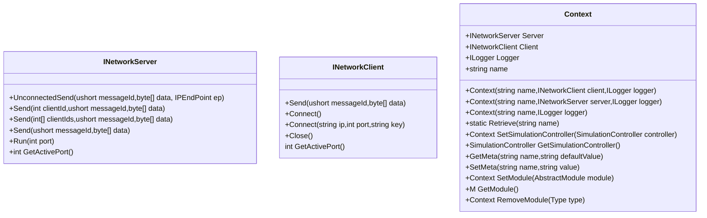

# 帧同步开发框架

这是一个基于netstandart2.0的帧同步游戏开发SDK，提供服务器，客户端部分。目前主要的代码示例用Unity编写客户端，netcore控制台程序为服务端。

## 项目结构如下

- `Docs/`
  - `Diagrams/`: 说明文件。  
  - `Protocols/`: 协议工具和配置。  
- `Engine/`: SDK目录。 
  - `Client/`: 供客户端项目使用的库，引用Common项目，基于netstandard2.0项目。
  - `Common/`: Client和Server项目的基础引用库，基于netstandard2.0项目。
  - `Server/`: 供服务端项目使用的库，引用Common项目，基于netstandard2.0项目。
- `Examples/`: 案例项目。
  - `Clients/`: 目前有一个案例项目，使用Unity开发。
  - `Servers/`: 目前一个netcore控制台程序。

## 说明
### API
SDK中找到Context类，这是框架的主类，在客户端和服务端中都用这个类作为程序入口，默认Context的name是：
```csharp
public const string CLIENT = "client";
public const string SERVER = "server";
```
在构造方法里传入name来指定对应的Context，对应的获取方法：
```csharp
Context.Retrieve(name);
```


ContextMetaId中定义的内置类型如下，通过Context.SetMeta和Context.GetMeta来存储和读取类型。
```csharp
public sealed class ContextMetaId
{
    public const string USER_ID = "user_id";
    public const string SERVER_ADDRESS = "server_address";
    public const string MAX_CONNECTION_COUNT = "max_connection_count";
    public const string ROOM_MODULE_FULL_PATH = "room_module_full_path";
    public const string STANDALONE_MODE_PORT = "standalone_mode_port";
    public const string GATE_SERVER_PORT = "gate_server_port";
    public const string SELECTED_ROOM_MAP_ID = "selected_room_map_id";
    public const string PERSISTENT_DATA_PATH = "persistent_data_path";
}
```