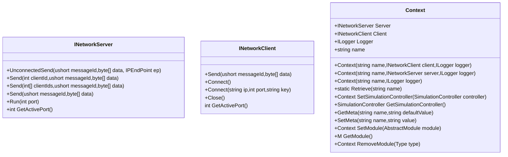

# 帧同步开发框架

这是一个基于netstandart2.0的帧同步游戏开发SDK，提供服务器，客户端部分。目前主要的代码示例用Unity编写客户端，netcore控制台程序为服务端。

## 项目结构如下

- `Docs/`
  - `Diagrams/`: 说明文件。  
  - `Protocols/`: 协议工具和配置。  
- `Engine/`: SDK目录。 
  - `Client/`: 供客户端项目使用的库，引用Common项目，基于netstandard2.0项目。
  - `Common/`: Client和Server项目的基础引用库，基于netstandard2.0项目。
  - `Server/`: 供服务端项目使用的库，引用Common项目，基于netstandard2.0项目。
- `Examples/`: 案例项目。
  - `Clients/`: 目前有一个案例项目，使用Unity开发。
  - `Servers/`: 目前一个netcore控制台程序。

## 说明
### API
SDK中找到Context类，这是框架的主类，在客户端和服务端中都用这个类作为程序入口，默认Context的name是：
```csharp
public const string CLIENT = "client";
public const string SERVER = "server";
```
在构造方法里传入name来指定对应的Context，对应的获取方法：
```csharp
Context.Retrieve(name);
```


ContextMetaId中定义的内置类型如下，通过Context.SetMeta和Context.GetMeta来存储和读取类型。
```csharp
public sealed class ContextMetaId
{
    public const string USER_ID = "user_id";
    public const string SERVER_ADDRESS = "server_address";
    public const string MAX_CONNECTION_COUNT = "max_connection_count";
    public const string ROOM_MODULE_FULL_PATH = "room_module_full_path";
    public const string STANDALONE_MODE_PORT = "standalone_mode_port";
    public const string GATE_SERVER_PORT = "gate_server_port";
    public const string SELECTED_ROOM_MAP_ID = "selected_room_map_id";
    public const string PERSISTENT_DATA_PATH = "persistent_data_path";
}
```
服务端代码案例
服务器分Gate和Battle两部分，如下是Gate服务端的代码案例：
```csharp
const string TAG = "gate-room";
static void Main(string[] args)
{
    Context context = new Context(Context.SERVER, new LiteNetworkServer(TAG), new DefaultConsoleLogger(TAG))
        .SetMeta(ContextMetaId.ROOM_MODULE_FULL_PATH, "battle_dll_path.dll")// the battle project's build path.
        .SetMeta(ContextMetaId.MAX_CONNECTION_COUNT,"16")
        .SetMeta(ContextMetaId.SERVER_ADDRESS,"127.0.0.1")
        .SetModule(new RoomModule());
    context.Server.Run(9030);
    Console.ReadLine();
}
```
- *构造Context主类，传入name是"server"。传入LiteNetworkServer实例*
- *必须设置的内置Meta数据，配置battle部分dll路径，这个路径的程序会以进程的方式单独启动*
- *必须设置的内置Meta数据，配置最大连接数*
- *必须设置的内置Meta数据，服务器地址*
- *添加模块RoomModule，该模块用来管理登录用户的创建房间，加入房间，离开房间等*

接下来是Battle项目案例：
```csharp
static void Main(string[] args)
{
    string key = "SomeConnectionKey";
    int port = 50000;
    uint mapId = 1;
    ushort playerNumber = 100;
    int gsPort = 9030;
    if (args.Length > 0)
    {
        if (Array.IndexOf(args, "-key") > -1) key = args[Array.IndexOf(args, "-key") + 1];
        if (Array.IndexOf(args, "-port") > -1) port = Convert.ToInt32(args[Array.IndexOf(args, "-port") + 1]);
        if (Array.IndexOf(args, "-mapId") > -1) mapId = Convert.ToUInt32(args[Array.IndexOf(args, "-mapId") + 1]);
        if (Array.IndexOf(args, "-playernumber") > -1) playerNumber = Convert.ToUInt16(args[Array.IndexOf(args, "-playernumber") + 1]);
        if (Array.IndexOf(args, "-gsPort") > -1) gsPort = Convert.ToInt32(args[Array.IndexOf(args, "-gsPort") + 1]);
    }
    Context context = new Context(Context.SERVER, new LiteNetworkServer(key), new DefaultConsoleLogger(key))
        .SetMeta(ContextMetaId.MAX_CONNECTION_COUNT, playerNumber.ToString())
        .SetMeta(ContextMetaId.SELECTED_ROOM_MAP_ID, mapId.ToString())
        .SetMeta(ContextMetaId.GATE_SERVER_PORT, gsPort.ToString())
        .SetModule(new BattleModule());
    SimulationController simulationController = new SimulationController();
    simulationController.CreateSimulation(new Simulation(),new ISimulativeBehaviour[] { new ServerLogicFrameBehaviour() });
    context.SetSimulationController(simulationController);
    context.Server.Run(port);
    Console.ReadKey();
}
```
- *构造Context主类，传入name是"server"。传入LiteNetworkServer实例*
- *必须设置的内置Meta数据，配置最大连接数*
- *必须设置的内置Meta数据，设置地图Id*
- *必须设置的内置Meta数据，设置Gate服务端的端口*
- *添加模块BattleModule，该模块处理帧同步的具体细节*

客户端部分的代码也和服务端的类似，都是通过Context主类来设置的，下面是案例代码：
```csharp
void Awake(){
  MainContext = new Context(Context.CLIENT, new LiteNetworkClient(), new UnityLogger("Unity"));
  MainContext.SetMeta(ContextMetaId.STANDALONE_MODE_PORT, "50000")
              .SetMeta(ContextMetaId.PERSISTENT_DATA_PATH, Application.persistentDataPath);
  MainContext.SetModule(new GateServiceModule())
              .SetModule(new BattleServiceModule());
  DefaultSimulationController defaultSimulationController = new DefaultSimulationController();
  MainContext.SetSimulationController(defaultSimulationController);
  defaultSimulationController.CreateSimulation(new DefaultSimulation(),new EntityWorld(),
      new ISimulativeBehaviour[] {
          new LogicFrameBehaviour(),
          new RollbackBehaviour(),
          new EntityBehaviour(),
          new ComponentsBackupBehaviour(),
      },
      new IEntitySystem[]
      {
          new AppearanceSystem(),
          new MovementSystem(),
          new ReboundSystem(),
      });
  EntityWorld entityWorld = defaultSimulationController.GetSimulation<DefaultSimulation>().GetEntityWorld();
  entityWorld.SetEntityInitializer(new GameEntityInitializer(entityWorld));
  entityWorld.SetEntityRenderSpawner(new GameEntityRenderSpawner(entityWorld,GameContainer));
}
```
这个项目引用了 https://github.com/omid3098/OpenTerminal 库用来显示测试命令方便调试API，按下键盘'`'打开命令行。

[Sample1 Demo]https://github.com/user-attachments/assets/75d00d10-824e-459d-87e1-5000da1ee7cf


| OpenTerminal命令   | SDK中的API   | 备注   |  
|:--------|:---------|:--------|  
|setuid   |  contextInst.SetMeta(ContextMetaId.USER_ID, uid); | 设置Context中的用户数据  |  
|connect   |  contextInst.Client.Connect(127.0.0.1, 9030, "gate-room");  | 默认连接到服务器  |   
|connect-ip-port-key   |  contextInst.Client.Connect(ip, port, key); | 连接到指定服务器  |   
|create   | contextInst.GetModule<GateServiceModule>().RequestCreateRoom(mapid);| 连接到服务器后创建房间  |  
|join   | contextInst.GetModule<GateServiceModule>().RequestJoinRoom(roomId);| 加入到指定房间  |  
|leave   | contextInst.GetModule<GateServiceModule>().RequestLeaveRoom();| 离开指定房间  |  
|roomlist   | contextInst.GetModule<GateServiceModule>().RequestRoomList();| 刷新房间列表  |  
|launch   | contextInst.GetModule<GateServiceModule>().RequestLaunchGame();| 开始游戏  | 
|updateteam   | contextInst.GetModule<GateServiceModule>().RequestUpdatePlayerTeam(roomId, userId, teamId);| 在房间内更新房间数据  | 
|updatemap   | contextInst.GetModule<GateServiceModule>().RequestUpdateMap(roomId, mapId, maxPlayerCount);| 在房间内更换地图  |  
|stop   | 请查看Sample.cs及其子类中Stop方法| 结束游戏  |  
|drawmap   | 请查看Sample.cs及其子类中DrawMap方法| 绘制地图  |  
|saverep   | 请查看Sample.cs及其子类中SaveReplay方法| 保存回放（录像）  |  
|playrep   | 请查看Sample.cs及其子类中PlayReplay方法| 保存回放（录像）  |
