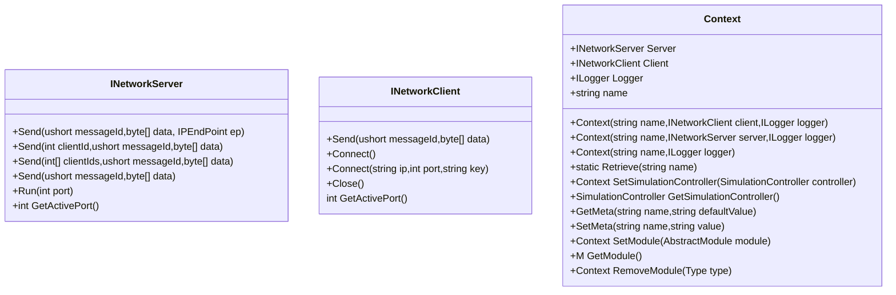

# 帧同步开发框架

这是一个基于netstandart2.0的帧同步游戏开发SDK，提供服务端，客户端的SDK部分。目前主要的代码案例用Unity编写客户端，netcore控制台程序为服务端。

## 项目结构如下

- `Docs/`
  - `Diagrams/`: 说明文件。  
  - `Protocols/`: 协议工具和配置。  
- `Engine/`: SDK目录。 
  - `Client/`: 供客户端项目使用的库，引用Common项目，基于netstandard2.0项目。
  - `Common/`: Client和Server项目的基础引用库，基于netstandard2.0项目。
  - `Server/`: 供服务端项目使用的库，引用Common项目，基于netstandard2.0项目。
- `Examples/`: 案例项目。
  - `Clients/`: 目前有一个案例项目，使用Unity开发。
  - `Servers/`: 目前一个netcore控制台程序。

## 说明
### API
SDK中找到Context类，这是框架的主类，在客户端和服务端中都用这个类作为程序入口，默认Context的name是：
```csharp
public const string CLIENT = "client";
public const string SERVER = "server";
```
在构造方法里传入name来指定对应的Context，对应的获取方法：
```csharp
Context.Retrieve(name);
```


ContextMetaId中定义的内置类型如下，这些类型会在SDK内部使用，用户还可以通过Context.SetMeta和Context.GetMeta来存储和读取自定义类型。
```csharp
public sealed class ContextMetaId
{
    public const string USER_ID = "user_id";
    public const string SERVER_ADDRESS = "server_address";
    public const string MAX_CONNECTION_COUNT = "max_connection_count";
    public const string ROOM_MODULE_FULL_PATH = "room_module_full_path";
    public const string STANDALONE_MODE_PORT = "standalone_mode_port";
    public const string GATE_SERVER_PORT = "gate_server_port";
    public const string SELECTED_ROOM_MAP_ID = "selected_room_map_id";
    public const string PERSISTENT_DATA_PATH = "persistent_data_path";
}
```
### 服务端代码案例
服务器分Gate和Battle两部分，Gate服务旨在提供用户一个大厅服务，让用户登录进来，每一个用户有一个不同的uid，这个uid目前仅用不同的字符串区别测试就可以，正式项目应该是数据库中的guid以确保每一个用户的id是唯一的。在这个Gate服务中提供用户创建房间，加入房间，离开房间等有关组队的服务。当多用户在房间内开启战斗的时候Gate服务会开启Battle服务的新进程让并告知这些用户去进入Battle服务。每一个战斗都会开启一个新的Battle进程。在Battle服务中具体实现了同步关键帧给所有用户的服务。

如下是Gate服务端的代码案例：
```csharp
const string TAG = "gate-room";
static void Main(string[] args)
{
    // 使用Context.SERVER 构造Context
    Context context = new Context(Context.SERVER, new LiteNetworkServer(TAG), new DefaultConsoleLogger(TAG))
        .SetMeta(ContextMetaId.ROOM_MODULE_FULL_PATH, "battle_dll_path.dll")// the battle project's build path.
        .SetMeta(ContextMetaId.MAX_CONNECTION_COUNT,"16")
        .SetMeta(ContextMetaId.SERVER_ADDRESS,"127.0.0.1")
        .SetModule(new RoomModule());
    context.Server.Run(9030);
    Console.ReadLine();
}
```
- *构造Context主类，传入name是"server"。传入LiteNetworkServer实例*
- *必须设置的内置Meta数据，配置battle部分dll路径，这个路径的程序会以进程的方式单独启动*
- *必须设置的内置Meta数据，配置最大连接数*
- *必须设置的内置Meta数据，服务器地址*
- *添加模块RoomModule，该模块用来管理登录用户的创建房间，加入房间，离开房间等*

接下来是Battle项目案例：
```csharp
static void Main(string[] args)
{
    string key = "SomeConnectionKey";
    int port = 50000;
    uint mapId = 1;
    ushort playerNumber = 100;
    int gsPort = 9030;
    // 一些从Gate服务中传入的参数
    if (args.Length > 0)
    {
        if (Array.IndexOf(args, "-key") > -1) key = args[Array.IndexOf(args, "-key") + 1];
        if (Array.IndexOf(args, "-port") > -1) port = Convert.ToInt32(args[Array.IndexOf(args, "-port") + 1]);
        if (Array.IndexOf(args, "-mapId") > -1) mapId = Convert.ToUInt32(args[Array.IndexOf(args, "-mapId") + 1]);
        if (Array.IndexOf(args, "-playernumber") > -1) playerNumber = Convert.ToUInt16(args[Array.IndexOf(args, "-playernumber") + 1]);
        if (Array.IndexOf(args, "-gsPort") > -1) gsPort = Convert.ToInt32(args[Array.IndexOf(args, "-gsPort") + 1]);
    }
    Context context = new Context(Context.SERVER, new LiteNetworkServer(key), new DefaultConsoleLogger(key))
        .SetMeta(ContextMetaId.MAX_CONNECTION_COUNT, playerNumber.ToString())
        .SetMeta(ContextMetaId.SELECTED_ROOM_MAP_ID, mapId.ToString())
        .SetMeta(ContextMetaId.GATE_SERVER_PORT, gsPort.ToString())
        .SetModule(new BattleModule());
    SimulationController simulationController = new SimulationController();
    simulationController.CreateSimulation(new Simulation(),new ISimulativeBehaviour[] { new ServerLogicFrameBehaviour() });
    context.SetSimulationController(simulationController);
    context.Server.Run(port);
    Console.ReadKey();
}
```
- *构造Context主类，传入name是"server"。传入LiteNetworkServer实例*
- *必须设置的内置Meta数据，配置最大连接数*
- *必须设置的内置Meta数据，设置地图Id*
- *必须设置的内置Meta数据，设置Gate服务端的端口*
- *添加模块BattleModule，该模块处理帧同步的具体细节*

### 客户端代码案例
客户端部分的代码也和服务端的类似，都是通过Context主类来设置的，下面是案例1代码：
```csharp
void Awake(){
  // 用Context.CLIENT构造Context，客户端的Context还需要指定SimulationController等，因此比服务端的Context稍微复杂一些
  MainContext = new Context(Context.CLIENT, new LiteNetworkClient(), new UnityLogger("Unity"));
  MainContext.SetMeta(ContextMetaId.STANDALONE_MODE_PORT, "50000")
              .SetMeta(ContextMetaId.PERSISTENT_DATA_PATH, Application.persistentDataPath);
  MainContext.SetModule(new GateServiceModule())      //大厅组队相关服务
              .SetModule(new BattleServiceModule());  //帧同步服务
  DefaultSimulationController defaultSimulationController = new DefaultSimulationController();
  MainContext.SetSimulationController(defaultSimulationController);
  defaultSimulationController.CreateSimulation(new DefaultSimulation(),new EntityWorld(),
      new ISimulativeBehaviour[] {
          new LogicFrameBehaviour(),        //逻辑帧累加，保存关键帧等
          new RollbackBehaviour(),          //网络关键帧回滚
          new EntityBehaviour(),            //执行ECS中System
          new ComponentsBackupBehaviour(),  //关键帧备份并同步至服务
      },
      new IEntitySystem[]
      {
          new AppearanceSystem(),           //外观显示系统
          new MovementSystem(),             //自定义移动系统，计算所有Movement组件
          new ReboundSystem(),              //自定义反弹系统
      });
  EntityWorld entityWorld = defaultSimulationController.GetSimulation<DefaultSimulation>().GetEntityWorld();
  entityWorld.SetEntityInitializer(new GameEntityInitializer(entityWorld));       // 用于初始化和构造Entity
  entityWorld.SetEntityRenderSpawner(new GameEntityRenderSpawner(entityWorld,GameContainer));     //ECSR中Renderer的构造
}
```
- *必须设置的内置Meta数据，设置程序数据目录*
- *设置GateServiceModule，用于连接Gate服务端*
- *设置BattleServiceModule，用于连接Battle服务端，帧同步的细节在这里定义*
- *设置模拟器Simulation控制器，并在控制器内设置模拟器和ECSR配置*
- *Behaviour设置*
  - *（必须）逻辑帧号管理和处理*
  - *（必须）回滚*
  - *（必须）ECSR逻辑执行*
  - *（必须）备份和发送*
- *ECSR中S配置*
  - *（可选）物体加载和显示系统*
  - *（可选）移动系统*
  - *（可选）反弹系统，可以在案例1视频中看到球与墙面的反弹*

### 案例1视频

https://github.com/user-attachments/assets/75d00d10-824e-459d-87e1-5000da1ee7cf

这个案例展示了多个实体在两个客户端中同步运行的结果。在运行过程中物体不能被控制，因此这个案例也是最简单的案例，所有物体在初始化那一刻他们的运动随逻辑帧的变化都是确定的。

### 案例2视频

https://github.com/user-attachments/assets/66622bac-50d7-44ad-8afa-cac510a5132b

这个案例展示用户可以控制物体运动，并且在多个客户端中都能同步物体运动的变化。

### 案例测试API
所有的案例项目均引用了 https://github.com/omid3098/OpenTerminal 库用来显示测试命令方便调试API，按下键盘 '`' 打开命令行。

| OpenTerminal命令   | SDK中的API   | 备注   |  
|:--------|:---------|:--------|  
|setuid   |  contextInst.SetMeta(ContextMetaId.USER_ID, uid); | 设置Context中的用户数据  |  
|connect   |  contextInst.Client.Connect(127.0.0.1, 9030, "gate-room");  | 默认连接到服务器  |   
|connect-ip-port-key   |  contextInst.Client.Connect(ip, port, key); | 连接到指定服务器  |   
|create   | contextInst.GetModule<GateServiceModule>().RequestCreateRoom(mapid);| 连接到服务器后创建房间  |  
|join   | contextInst.GetModule<GateServiceModule>().RequestJoinRoom(roomId);| 加入到指定房间  |  
|leave   | contextInst.GetModule<GateServiceModule>().RequestLeaveRoom();| 离开指定房间  |  
|roomlist   | contextInst.GetModule<GateServiceModule>().RequestRoomList();| 刷新房间列表  |  
|launch   | contextInst.GetModule<GateServiceModule>().RequestLaunchGame();| 开始游戏  | 
|updateteam   | contextInst.GetModule<GateServiceModule>().RequestUpdatePlayerTeam(roomId, userId, teamId);| 在房间内更新房间数据  | 
|updatemap   | contextInst.GetModule<GateServiceModule>().RequestUpdateMap(roomId, mapId, maxPlayerCount);| 在房间内更换地图  |  
|stop   | 请查看Sample.cs及其子类中Stop方法| 结束游戏  |  
|drawmap   | 请查看Sample.cs及其子类中DrawMap方法| 绘制地图  |  
|saverep   | 请查看Sample.cs及其子类中SaveReplay方法| 保存回放（录像）  |  
|playrep   | 请查看Sample.cs及其子类中PlayReplay方法| 保存回放（录像）  |

### 数据结构
下面列出SDK中一些关键的数据结构，这些也可以成为协议结构体，这些可以序列化和反序列化并且支持字段可选数据结构在SDK中大量使用。可以通过Docs/Protocols/中的工具生成，形如：
```csharp
public class PtMyData
{
  //Fields
  public static byte[] Write(PtMyData value){}
  public static PtMyData Read(byte[] bytes){}
}
```

| 类名   | 字段   | 备注   |
|:--------|:---------|:--------|  
|PtFrame|string EntityId<br>PtComponentUpdaterList Updater<br>byte[] NewEntitiesRaw|一个关键帧数据|
|PtFrames|int FrameIdx<br>List<PtFrame> KeyFrames|在某一帧的所有关键帧集合|
|PtMap|string Version<br>EntityList Entities|地图数据|
|PtReplay|string Version<br>uint MapId<br>List<EntityList> InitEntities<br>List<List<PtFrame>> Frames|录像（回放）数据|

## 录像（回放）机制
录像（回放）机制是帧同步技术中最有特点的机制，也是一个绕不开的点。SDK中也有录像的保存加载。

## 帧同步模拟器
一下三张图分别描述了帧同步模拟器在三种不同场景下的使用情况。

下图表示客户端，服务端在同一时刻的大致行为，还有回放逻辑也是对应一直的行为。


这张图是客户端和服务端在每一个逻辑TICK中执行逻辑。上半部分是客户端，客户端需要执行的逻辑包含ECSR部分，下半部分是服务端部分。


最后一张图是描述回放的每一个逻辑帧。


通过这几张图结合具体做什么类型的游戏，我们可以设置自定义System和Component来处理相关逻辑。

# 项目任务  
- [x] SDK基本功能部分 
  - [x] 大厅服务和帧同步服务
  - [x] 基于二进制的协议
  - [x] 地图绘制保存和加载
  - [x] 录像（回放）保存和加载重播
- [x] 两个简单案例
- [x] 断线重连（可以在上述两个简单案例中测试，重连的客户端用相同的uid重新加入房间即可）
- [ ] 一个简单RTS游戏（包含主角，野怪，敌人）的打斗 (正在做)
- [ ] 物理引擎同步（暂无计划）
 

# 引用  
- https://github.com/omid3098/OpenTerminal 方便的调试命令插件
- https://github.com/RevenantX/LiteNetLib UDP网络库